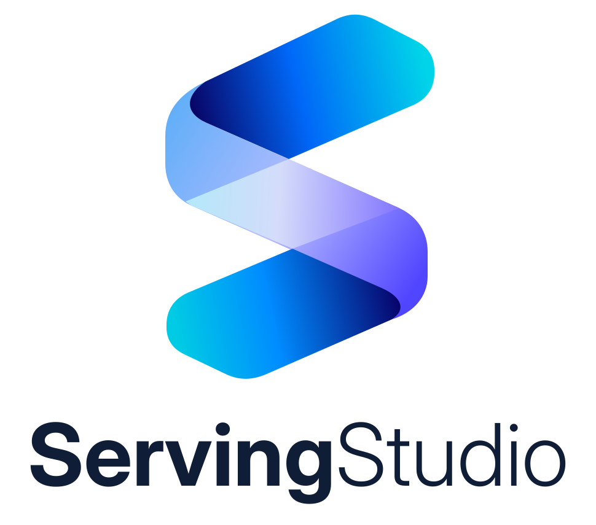
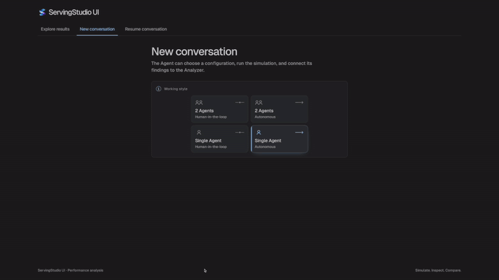

<p align="center">
  <picture>
    <source media="(prefers-color-scheme: dark)" srcset="branding/servingstudio-logo-dark.svg">
    
  </picture>
</p>

<p align="center"><strong>A simulator to predict. An Agent to act.</strong></p>

<p align="center">
  <a href="https://syfi-servingstudio.github.io/ServingStudioIntro/">Website</a> ·
  <a href="#demo">Demo</a> ·
  <a href="#workflow">Workflow</a> ·
  <a href="#features">Features</a> ·
  <a href="#quick-start">Quick start</a> ·
  <a href="#documentation">Documentation</a>
</p>

---

ServingStudio is an integrated workbench for analyzing, simulating, and optimizing LLM serving systems. ServingStudio consists of three components:

- ServingStudio Sim predicts serving system performance using measured GPU kernel timings.
- ServingStudio Agent drives the simulation, investigates results, and helps implement
and validate improvements in real serving frameworks.
- ServingStudio UI provides results visualization and zero-code interaction with the Agent.

This repository is the **main entry point for ServingStudio**, with
compatible component revisions and shared commands to build and run them.

<a id="demo"></a>
## 🎬 Demo

<p align="center">
  <a href="branding/servingstudio-demo.mp4">
    
  </a>
</p>

Explore the [product introduction](https://syfi-servingstudio.github.io/ServingStudioIntro/)
for workflows and performance case studies.

## 📣 News

- **September 2026** · Introducing ServingStudio: a simulator, an Agent, and an
  interactive analysis application for LLM serving research and development.

<a id="workflow"></a>
## 💡 From real measurements to real improvements

ServingStudio connects simulation and implementation in one evidence-driven loop:

| Step | Stage | What happens |
| ---: | --- | --- |
| 1 | **Understand the workload** | Define the model, request mix, hardware, and performance objective; establish a measured baseline from the existing system. |
| 2 | **Explore in simulation** | Compare serving configurations and inspect operation costs to identify a promising improvement. |
| 3 | **Build with the Agent** | Implement the selected change in a real serving framework, from a kernel optimization to a new model implementation. |
| 4 | **Profile the change** | Capture a GPU trace and inspect kernel timings, communication, and idle gaps in the modified implementation. |
| 5 | **Align back with simulation** | Compare prediction with measurement and attribute differences in kernels, batching, communication, and host overhead. |
| 6 | **Validate on real hardware** | Check correctness and measure serving performance, then accept the improvement or use the evidence to guide another iteration. |

The loop keeps the simulator grounded in measured execution while using its
predictions to guide changes in the real system.

<a id="features"></a>
## ✨ Key features

<table>
  <tr>
    <td width="50%" valign="top">
      <h3>🧩 Flexible configuration</h3>
      <p>Explore dense and mixture-of-experts models across precisions, GPU layouts, parallelism choices, and serving strategies.</p>
    </td>
    <td width="50%" valign="top">
      <h3>⚡ Fast simulation</h3>
      <p>Reach steady state and compare more configurations with a simulator designed to explore long workloads quickly.</p>
    </td>
  </tr>
  <tr>
    <td width="50%" valign="top">
      <h3>🎯 Accurate predictions</h3>
      <p>Ground predictions in kernel timings measured on real GPUs and calibrate them against vLLM and SGLang.</p>
    </td>
    <td width="50%" valign="top">
      <h3>🔎 Full observability</h3>
      <p>Follow performance from the whole run through individual requests and scheduler steps down to model operations and kernels.</p>
    </td>
  </tr>
  <tr>
    <td width="50%" valign="top">
      <h3>📊 Optimization insights</h3>
      <p>Attribute simulated GPU time, compare it with the model's necessary work, and identify where performance can improve.</p>
    </td>
    <td width="50%" valign="top">
      <h3>💬 Zero-code exploration</h3>
      <p>Give the Agent a serving goal and receive experiments, analysis, tradeoffs, and supporting evidence without writing simulation code.</p>
    </td>
  </tr>
</table>

## 🧩 The workspace

| Component | What it provides |
| --- | --- |
| [**ServingStudio Sim**](ServingStudioSim/README.md) | Serving simulation, kernel profiling, framework alignment, and the ServingStudio Analyzer result service. |
| [**ServingStudio Agent**](ServingStudioAgent/README.md) | Experiment execution, persistent conversations and workspaces, Docker runners, and configurable model providers. |
| [**ServingStudio UI**](ServingStudioUI/README.md) | Six analysis views and an integrated Agent page in one browser application. |
| [**ServingStudio Intro**](ServingStudioIntro/README.md) | The product introduction, workflows, and case studies. |

The workspace pins an exact commit for each component. Shared build and service
commands live in the [justfile](justfile) and [scripts/](scripts/).
All component repositories use `main`.

<a id="quick-start"></a>
## 🚀 Quick start

### Requirements

- **Linux**, Git, Python 3 with [uv](https://docs.astral.sh/uv/), **Rust stable**,
  Node.js 22/npm, and [just](https://just.systems/).
- A native C/C++ build toolchain, CMake, Ninja, pkg-config, Protocol Buffers
  compiler, **mold**, and tmux. See the [host setup commands](reproduce.md#host-setup).
- **Docker** and a configured Codex or Claude connection for Agent execution.
- NVIDIA GPUs and a compatible CUDA environment for GPU profiling and real
  framework runs. GPU requirements for simulation depend on the timing data and
  workflow; building the Analyzer and web application does not require CUDA.

### 1. Clone and build

```bash
git clone --recurse-submodules \
  https://github.com/SyFI-ServingStudio/ServingStudio.git servingstudio
cd servingstudio
just setup-env
just check-tools
just build
just build-runner-image
```

The build prepares all four components. For a first build on a remote machine,
follow the [tmux build instructions](reproduce.md#build).

### 2. Configure the Agent

```bash
cp ServingStudioAgent/examples/providers.yaml ServingStudioAgent/providers.yaml
chmod 600 ServingStudioAgent/providers.yaml
```

Edit the template with your provider connections, available models, per-model
efforts, and defaults. Follow the [provider configuration guide](ServingStudioAgent/doc/providers.md)
and [runner authentication setup](reproduce.md#run-the-application).
The private `providers.yaml` is ignored by Git and loaded from the Agent checkout.

### 3. Initialize and start

For a new installation, before its Agent state directory exists:

```bash
just agent-init
just start
just smoke-local
```

Open the **UI address printed by `just start`** to access the Agent and analysis
pages. This command starts the local development UI; see the
[deployment guide](reproduce.md) for production static hosting and proxy setup.

> [!NOTE]
> Initialize once. For an existing installation, use `just restart`.
> Existing legacy Agent state needs the [documented migration](ServingStudioAgent/doc/migration-v1.md)
> before startup.

### 4. Run your first experiment

Start a conversation with ServingStudio Agent and ask:

> Run the Llama 3 8B smoke simulation. Report throughput and latency, then show
> where simulated execution time is spent.

For the command-line workflow and its prerequisites, follow the
[simulator quick start](ServingStudioSim/README.md#quick-start).

<details>
<summary><strong>Service commands and workspace updates</strong></summary>

| Command | Purpose |
| --- | --- |
| `just services-status` | Check the services. |
| `just smoke-local` | Verify local endpoints. |
| `just restart` | Restart with the current checkout and configuration. |
| `just stop` | Stop this workspace's services. |

To update an existing clone after checking local changes:

```bash
git pull --ff-only
git submodule sync --recursive
git submodule update --init --recursive
```

These commands preserve the component revisions recorded by the workspace.
Use `git submodule update --remote` only when deliberately advancing those pins.

</details>

<a id="documentation"></a>
## 📚 Documentation

| Guide | Start here for |
| --- | --- |
| [Setup and deployment](reproduce.md) | Host dependencies, authentication, builds, services, and production hosting. |
| [Simulator documentation](ServingStudioSim/doc/README.md) | Model composition, simulation, profiling, and alignment. |
| [Architecture compatibility](ServingStudioSim/doc/architecture_compatibility.md) | Supported architecture and parallelism combinations. |
| [Agent architecture](ServingStudioAgent/doc/architecture.md) | Conversations, providers, workspaces, and job execution. |
| [UI documentation](ServingStudioUI/docs/README.md) | Analysis views and browser workflows. |
| [Contributing to the simulator](ServingStudioSim/CONTRIBUTING.md) | Development conventions and validation. |

Each component maintains its own source, documentation, and license terms.
